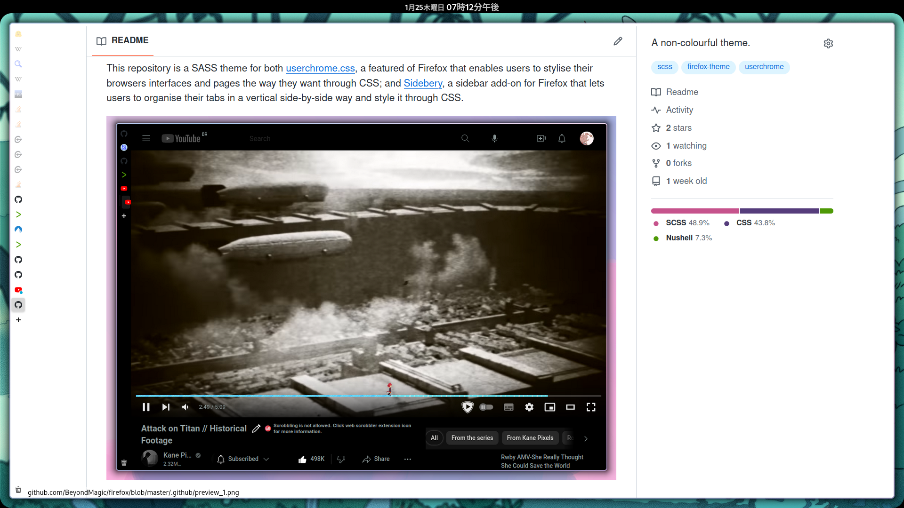

This repository is a SASS theme for both [userchrome.css](https://www.userchrome.org/), a featured of Firefox that enables users to stylise their browsers interfaces and pages the way they want through CSS; and [Sidebery](https://github.com/mbnuqw/sidebery), a sidebar add-on for Firefox that lets users to organise their tabs in a vertical side-by-side way and style it through CSS.

It is supposed to be used with both *Sidebery* and *userchrome.css* as both CSS files are interoperable.

The latest compiled files (CSS) can be get in [distribution folder](./distribution), the names are self-explanatory.

**Notes:**
- For more themes, see [FirefoxCSS Store](https://firefoxcss-store.github.io/);
- For more information about them and how to use *userchrome.css*, see [FirefoxCSS Store Repository](https://github.com/FirefoxCSS-Store/FirefoxCSS-Store.github.io).

___

**Roadmap:**
1. Automatic deduction for the Firefox profile folder for the linking subcommand functionality for the following operating systems:
    - [ ] Linux.
    - [ ] FreeBSD.
    - [ ] Windows.
    - [ ] MacOS.

___

Credits: `João Farias © 2023 BeyondMagic <beyondmagic@mail.ru>`.
